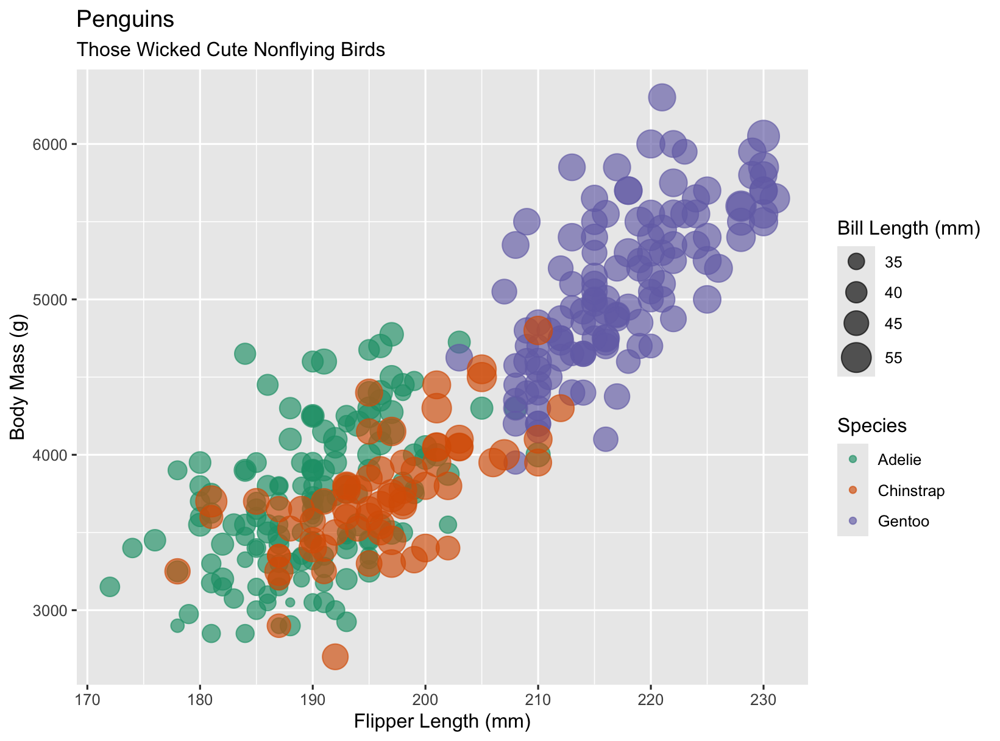
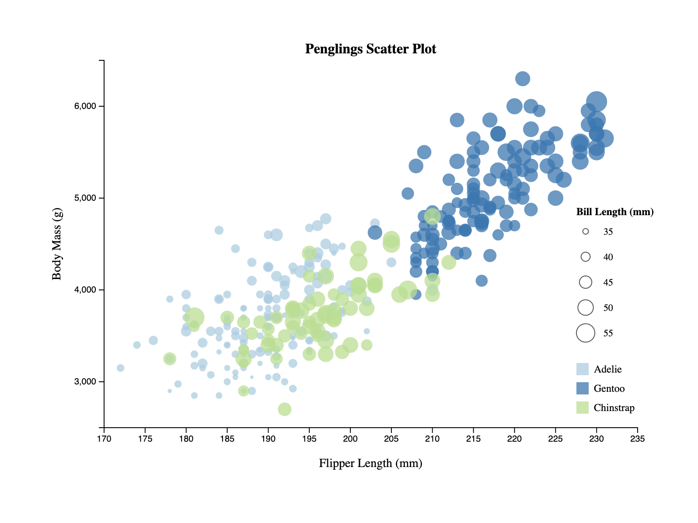
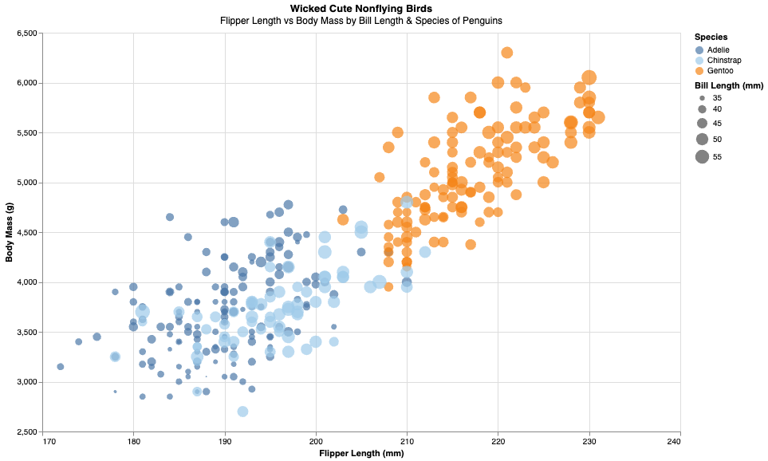
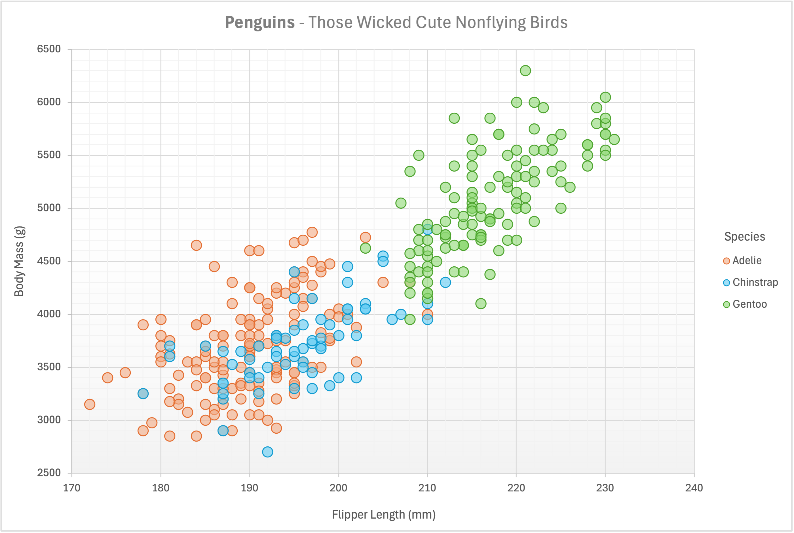
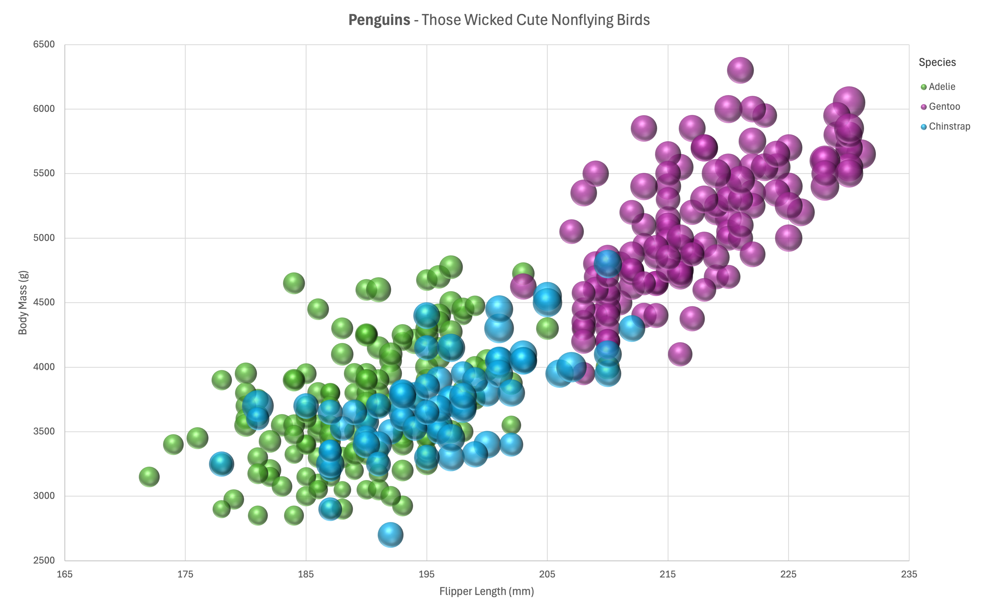
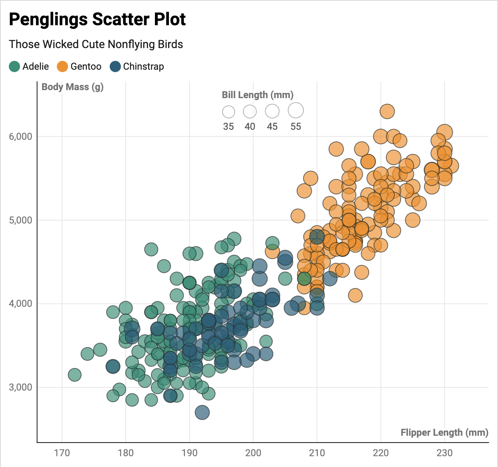
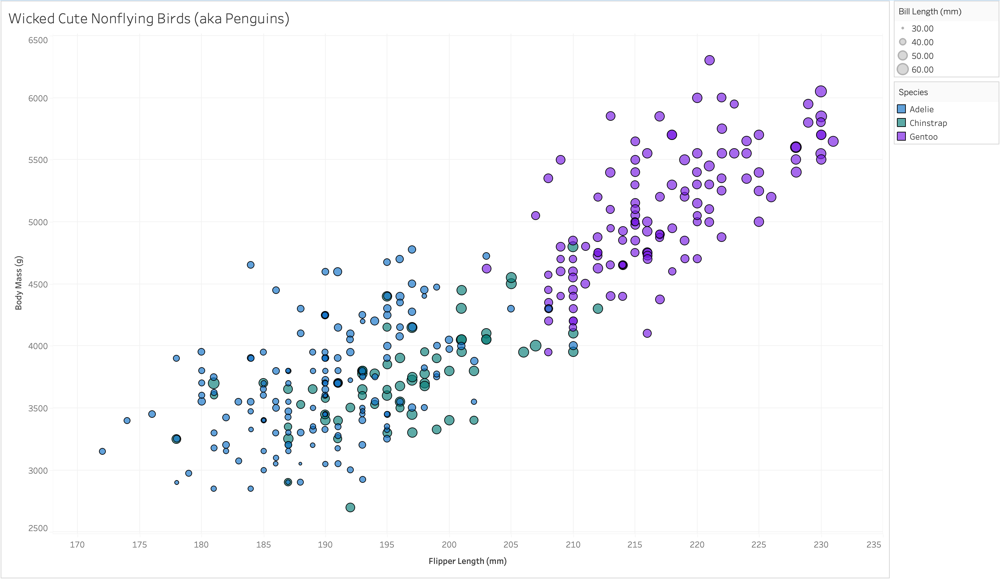
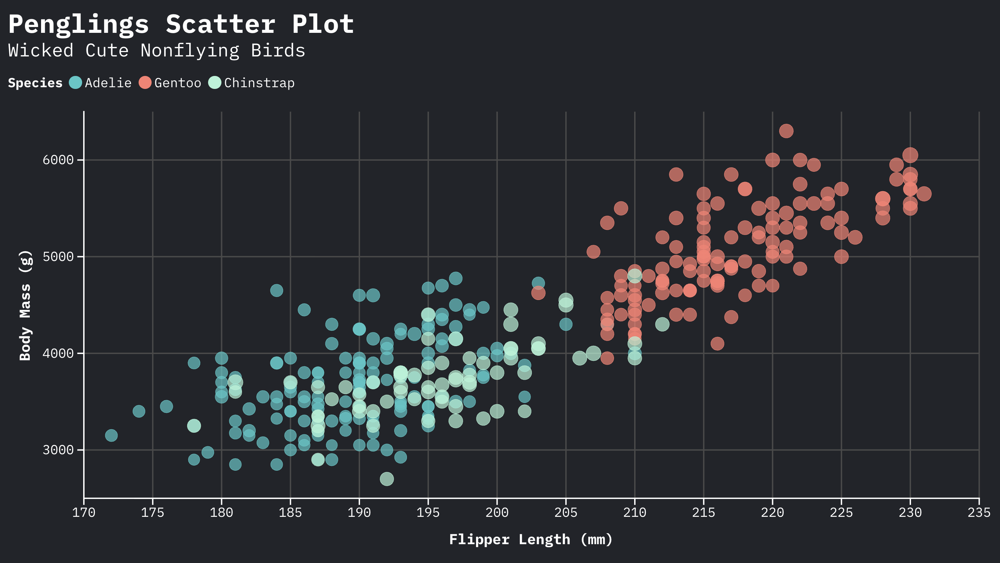

# Assignment 2

## R & ggplot

Using "ggplot" to make this plot was the default tool for me and I used the above plot as a reference when I made the other visualizations. I use R regularly and teach my students in introductory statistics how to use R, including how to make basic plots with the "ggplot2" library. Since I have years of experience using R, I found making this plot very easy and had existing code I could use as a template. One of the reasons I encourage my students to learn how to use "ggplot," rather than just use the default plotting functions in R (e.g., "plot" and "hist") is because I like the "ggplot" syntax being in one block of code, with the first line calling the data and laying out what variables within the data you are plotting, then "building" the plot with the corresponding lines. Once you learn the basics of "ggplot," it is easy to build on that knowledge and make more complex plots without significantly changing the base code.
 
 
For this plot, in R Script, I used the "geom_point()" layer and added features using "scale_()" layers for the color and size and "labs()" for the titles, axis labels, and legend labels.  

## d3 & JavaScript

This one was a doozy... To make such a basic plot using "d3" required much *much* more code than I used in "ggplot." Needing to create variables for every aspect of the plot (e.g., axes) did not make me interested in using this tool again to make this type of plot. Perhaps there is a use for this tool when making visualizations, but, having used "ggplot" for years, I do not see how "d3" could be a *better* option than R for basic plotting. While I did not explore all the possible options with "d3," there may be more flexibility than "ggplot," but I would only consider using this tool if I had to make a complex visualization that requires features not available in "ggplot" or "altair."
 
 
Or did I not use "d3" as effectively as I could have?

## altair & Python

Like "ggplot," I like the syntax of the "chart" function using one block of code. Further, I have some experience using Python, so I found this tool moderately easy to use. I had not before used "altair," but my prior knowledge with helped with understanding the syntax and how to add details to the code. I did not observe any limitations, in terms of what was needed to be on the plot, but I would still default to using "ggplot" because that is my comfort zone.

## Microsoft Excel - Scatter and Bubble

Excel was another tool that I found very easy to use due to years of experience. However, it does have limitations, like how I could not change the circle radii relative to "bill length" in the base scatterplot option. The size of the points could only be changed uniformly. Further, to distinguish point colors by "species," there is no option to "tell" the plot to color the points based on a categorical variable. Instead, you have to rearrange the data and create cells with "#N/A" for when a particular species was not related to the y-values for the highlighted x-values. While Excel did create a nice-looking plot, I typically use Excel for its spreadsheet capabilities, such as keeping track of student grades or formulating data sets to share with my students, and will continue to use Excel for those purposes.
 
 

After further attempts, I determined the bubble scatterplot allows the ability to change the radii of the circles based on an additional variable. However, it cannot generate a legend to indicate which sizes relate to which bill lengths, although if you hover over the points in Excel, you can see which points correspond to which bill lengths. Further, you are able to distinguish the varying sizes, but if you want a legend, you need to manually create it yourself with circle shapes. I discovered this feature does not work well on a Mac, since it is a Microsoft software, so after multiple attempts of the circles freezing on my graph and being unable to move them to where I wanted to generate a legend, I decided to forgo future attempts.

## DataWrapper

This was my first time using "DataWrapper" and I found it fairly easy to use. There were some limitations, such as the locations of the axis labels, and you were restricted to the options on the interface without the possibility of customization, but I appreciated how easy it was to "tell" the tool, for instance, that "bill length" was the size column. I liked how it had features to allow you to view the plot in "dark mode" and make changes the colors to provide access to those who are colorblind. However, since I am a huge fan of playing around with color palettes, I'm not likely to use this tool again. The colors could only be changed individually, instead of selecting a palette, like those available in "ggplot." I do not think I will use this tool for future visualizations.

## Tableau

This was my first time using "Tableau," although I had heard of it prior to this course. I had colleagues in industry who used it and those in financial mathematics who have used it. Similar to my experience with "DataWrapper," I found it fairly easy to use and appreciated all the available options for adding a variety of features to the plot. It had more customization options with these features, when compared to other GUI programs, such as being able to change the variation in the size of the circle radii relative to bill length. Further, I appreciated all the different color palette options, similar to those that can be found in "ggplot," "d3," and "altair." If I ever need an alternative tool for developing basic plots such as these, I would consider using "Tableau" again. 

## Flourish

This was my first time using "Flourish" and I found it fairly easy to use. I had similar thoughts on it as I did above with "DataWrapper." However, while it did allow changing the circle radii relative to "bill length," it did not have an option to add a legend nor did it allow me to change the variation in size. When looking at the plot, it is difficult to distinguish between the different-sized circles due to there not being a large enough range in size. Different sized radii, relative to one of the variables, is only useful if the plot is imbedded or shared properly, where you can then hover over individual points to see the values. I do not think I will use this tool for future visualizations.

---

# Technical Achievements

---

# Design Achievements
